# Dragon Tactics
[Click here to visit the published site.](https://arcliz.github.io/dragon-tactics/)

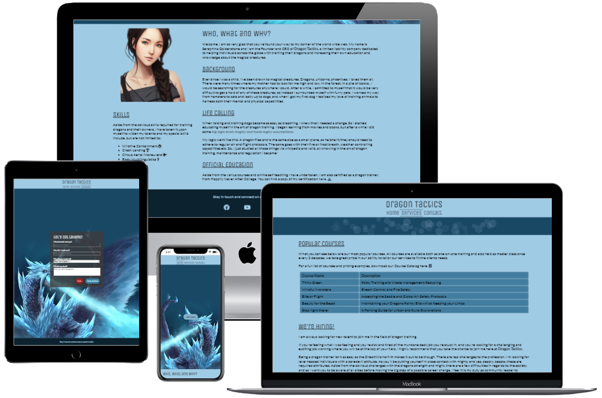

## Introduction

Dragon Tactics is a site made to present and advertise Seraphina Goldenstone and the LLC Dragon Tactics.<br>
The site is created to provide relevant information to users about what the company is, the services the company offers as well as how to get in touch with the company.

The website is comprised of the following sections:<br>

1. Home/About
2. Services
3. Contact Page

From the companys standpoint, the goals with the website are:
1. To reach more individuals with their company than what their old "word of mouth" strategy generated
2. To generate interest in dragon training and Dragon Tactics services
3. To provide a simple way of prospective clients or hires to contact them

From a user standpoint, the goals with the website are:
1. As a first time visitor, I want to find easy-to-read information about dragon training
2. As a first time visitor, I want to know what Dragon Tactics can offer me
3. As a first time visitor, I want to be able to contact Dragon Tactics

## UX

### **Strategy**
Due to the nature of the field, the company has met opposition in their past, which proved challenging in the initial planning phase of the project. 
Considering the lack of dragon believers in the world, individuals tend to doubt the legitimacy of the company and their services.
After speaking closely with Seraphina, we decided to address these problems with very specific site content, in addition to run of the mill company information and tables of services provided.
1. Link to a certificate, proving Seraphinas personal qualifications
2. Ability for users to contact Seraphina with doubts and questions
3. References to socially accepted theories and teachings
4. Media and images of dragons, Seraphina and dragon training to further cement the legitimacy of the work.

When deciding on features, design and technologies to use in the project, I first settled on the target user being:
- Aged 10-35
- Fantasy/Mythology interested
- Open minded

Much research into the specified target group resulted in narrowing down what these users would need to:
- Clean, modern and inspiring design
- Relevant and easily understood information
- Social Media links for follow up information
- Clear explanations and error fallbacks, in case of user-errors.

### **Scope**
After taking all of the above into account, we settled on the following features for the site:
- Header with a navigation menu for easy access to each page of the site
- Details about Seraphina and Dragon Tactics divided into easily managable sections of information
- Self Portrait of Seraphina
- Download link to Seraphinas official Dragon Trainer Certificate
- Easy-to-Read Table of the company's most popular courses on offer
- Fail proof contact form for users to connect with Seraphina/Dragon Tactics

### **Structure**
As a younger target group tends to shy away from too much information in one go, the site is divided into 3 different pages.

- **About/Home**,<br> containing information about Seraphina and the company's history, along with a list of skills and certifications.
- **Services**,<br> containing a table of the most popular courses on offer, along with additional access to their full list of services.
- **Contact**,<br> containing a contact form with required information to ensure that connection is made and can be replied to.

### **Skeleton**
[Wireframes](docs/wireframes.pdf)

I created very rough wireframes for the project which ended up not being followed exactly.<br>
At project inception, the idea was to have the landing page be a simple hero image page with just the navbar and footer.<br>
This idea was reworked and the landing page and the about page was merged into one, this to make the site easier to navigate and understand.<br>
The original wireframes also included a "Recruitment" page, which was later merged into the "Services" page as a design choice, as both Seraphina and myself liked the look of a 3-item navigation menu better.

### **Design**
For many, the thought of dragons bring thoughts of fire and destruction, which would have made a dark and red color theme the obvious choice. However, as we wanted to go for a *clean, modern and inspiring design*, we instead decided on a cold and frosty feeling instead. This was achieved with shades of icy blues and clean simplistic fonts through out the design.<br>
<br>
The font choices was made by doing a google search for fonts that pair well. However, I found no suggested pairing that suited my tastes, so I made my own combination of *Unica One* for headings and *Lato* for all bread text.

## Features

This site is built with a "mobile first" approach and all features scale from 320px up to any desktop size. <br>
All sections of the site has a maximum width of 1000px, to not overwhelm and stretch important content too far out in the periferals, should a user be using a very wide screened monitor.
### **Global Features**
#### **Navbar**
The navbar is featured on every page and attached to the top - for easy access and easy readability.


- Simple Logo with the company name
- Links to Home, Services and Contact pages

#### **Footer**
The footer is featured on every page attached to the bottom - for easy access and easy readability.


- Encouragement to keep in contact via social media
- Links to social media sites Facebook, Youtube and TikTok

### **Home page Features**
The Home page is the main landing page of the site, to set the tone and initially spark user interest.<br>
With a welcoming, sleek and inspiring design of high contrast blue tones and an inspiring hero image, users are invited to keep reading.

The page is responsive and turns from a row based structure to being divided into two columns on larger devices,<br>
to keep in line with the company and user set goals set forth in this document.

```
USER STORY

As a first time visitor, I want to find easy-to-read information about dragon training
```

IMPLEMENTATION:
#### **Hero Image**
A hero image depicting a dragon, to set the tone of the site. 

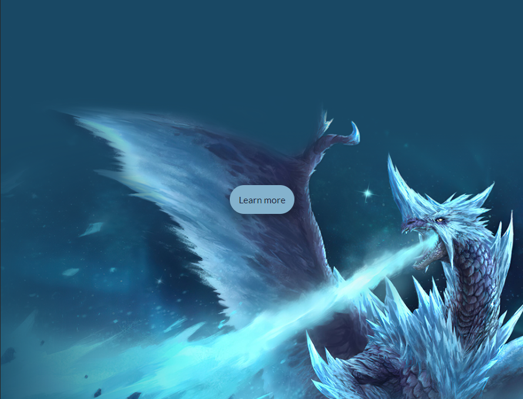

#### **About-Section**
The about section contains background history of Seraphina and the company Dragon Tactics.<br>

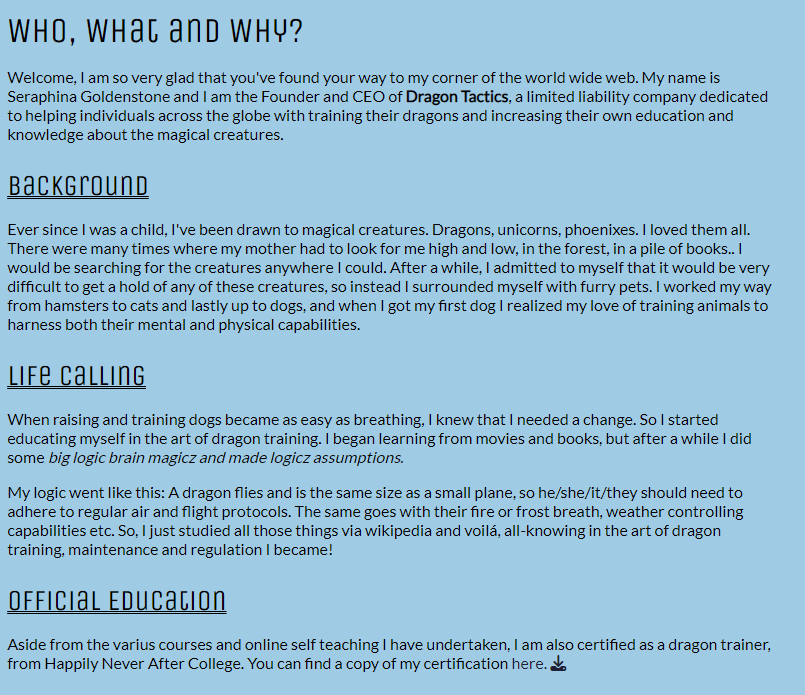
- Information divided into 4 sub sections, to keep the information light and easy to read.
- Link to a downloadable copy of Seraphina's Official Certification, to aid in credibility.

#### **Skills**
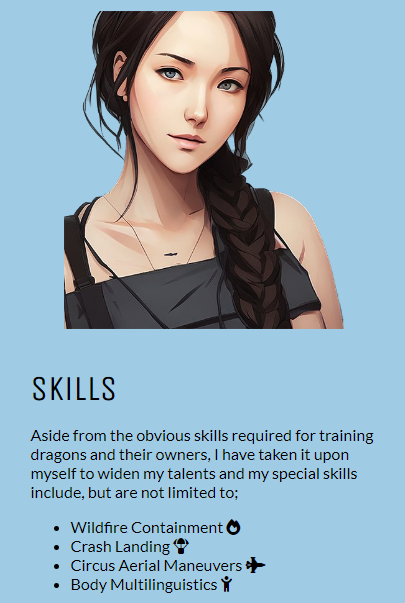
- Photograph of Seraphina
- Explanation and listing of specific skills she has aquired.

### **Services Page Features**
The Service page contains all the services and offers the company has for the user.

```
USER STORY

As a first time visitor, I want to know what Dragon Tactics can offer me
```

IMPLEMENTATION:
#### **Popular Courses Section**
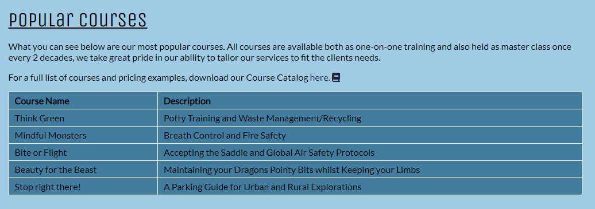
- Information regarding availability and type of courses on offer by the company
- Link to a downloadable course catalogue for the full list of available courses
- Table containing the Name and Quick Description of the 5 most popular courses on offer

#### **Recruitment Section**
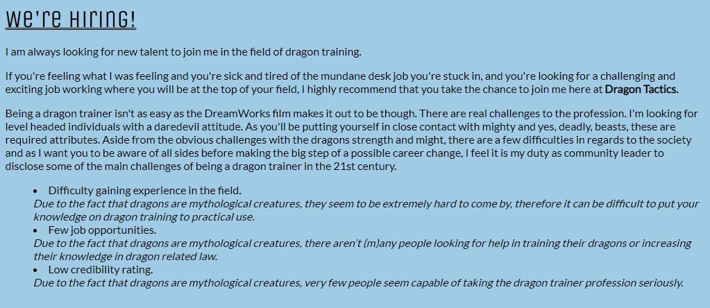
- Recruitment information
- List of challenges within the profession


### **Contact Page Features**
The Contact page contains a contact form that allows the user to contact Seraphina, for varius reasons.

```
USER STORY

As a first time visitor, I want to be able to contact Dragon Tactics
```

IMPLEMENTATION:
#### **Contact Form**
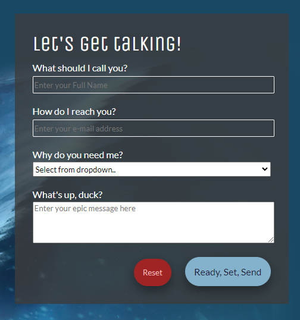
- Form that asks the user to submit name, e-mail address, their reason for contacting along with a message to send.
- All fields are required and the form will not submit unless all is filled in, to avoid misunderstandings in future communications.
- Reset button to return all fields to their empty starting state.
- Submit button to send the users message.

### **Other Pages**
The site contains two additional pages made to increase usability and make the user experience more enjoyable.

#### **404 Page**
- This page is shown when a user navigates to an unknown/broken page on the site
- The page contains identical header and footer elements as the sites main pages so that the user will be able to navigate back to the site without the use of the browser back button
- The page informs the user that they have ended up on a broken page/page that doesn't exist

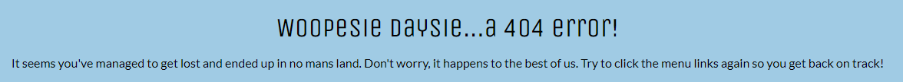

#### **Thank You Page**
- This page is shown when a user successfully submits the contact form
- The page contains identical header and footer elements as the sites main pages so that the user will be able to navigate back to the site without the use of the browser back button
- The page informs the user about the time frame in which they can expect Seraphina to reply to their messages

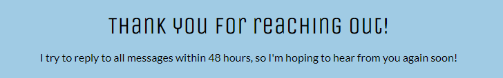

### **Future Enhancements**
- Upgrading the Contact Form to automatically e-mail Seraphina with the message the user sent.
- Adding a Gallery with images of Seraphina in action when doing her Dragon Training magic
- Personalize 404 and Thank You pages with a picture of Seraphina

## Testing

### **Feature Testing**

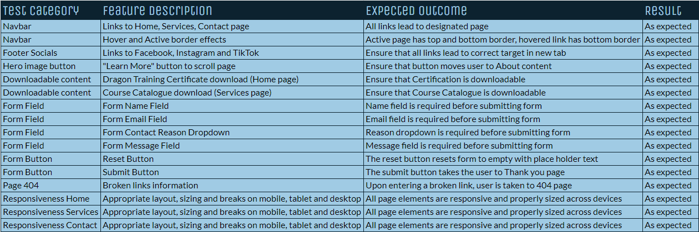

### **Validator Testing**
- HTML - validated using the official W3C Markup Validator. 
    - Index Page Results<br> 
    - Services Page Results<br> 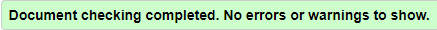
    - Contact Page Results<br> 
    - 404 Page Results<br> 
    - Thank You Page Results<br> 
- CSS - validated using the official W3C Jigsaw CSS Validation Service.
    - Site Results<br> 

### **Lighthouse**
The site has been tested using the Lighthouse function within Chrome Developer Tools.

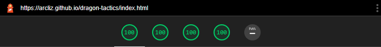
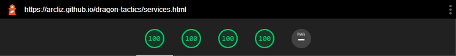
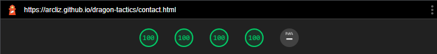

### **Wave**
The site has been continuously tested using the [Wave Web Accessibility Evaluation Tool](https://wave.webaim.org/) to ensure the site is accessible to individuals with impairments. 

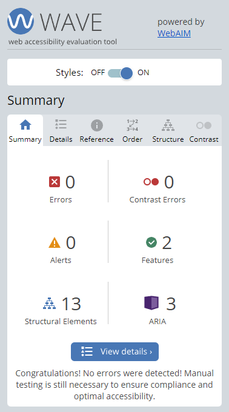

### **Compability**
The site is fully responsive and all features and functions has been tested on the following devices and web browsers:

- iPhone SE/12
    - Google Chrome
    - Safari
- iPad 3/19
    - Google Chrome
    - Safari
- Macbook Air
    - Google Chrome
    - Safari
    - Firefox
- Windows Desktop
    - Google Chrome
    - Edge
    - Firefox
    - Opera

## Deployment

The site was deployed by using GitHub pages. The steps to deploy are as follows:

*GitHub Pages Deployment*<br>
1. Open your projects GitHub repository (Please note that the project needs to be public in order for you to be able to deploy it)
2. Navigate to the Settings tab
3. Navigate to the Pages tab
4. Under the GitHub Pages from the source section drop-down menu, select the main branch
5. Once selected, it may take a few minutes for the project to go live

[View the live project here.](https://arcliz.github.io/dragon-tactics/)<br>

*Forking the GitHub Repository*<br>

If you wish to make a copy of the repository to your own GitHub account, you can do so by "Forking" it.<br>
This will give you a full working copy of the project, but ensures that no changes you make affect the original repository.
1. Navigate to the GitHub repository while logged into your account
2. In your top right, click the Fork button
3. Chose the name you want to give your version of the repository *(automatically filled in as the original project name)*
4. Click the green "Create fork" button

*Cloning the GitHub Repository*<br>

If you wish to download a local version of the repository to be worked on, you can do that too. That is referred to as "Cloning".<br>
The steps to cloning the repository are as follows:
1. Navigate to the GitHub repository while logged into your account
2. Click the <>Code dropdown button
3. Make sure that HTTPS is chosen, then copy the repository link to the clipboard<br>
*Git must be installed for the next steps to work*<br>
4. Open the IDE you're working in
5. Type "git clone (the url link you just copied)" into the terminal

The project will now be on your local machine to use or save. This can be a good way to back up versions of your own work too.

## Technologies

- **HTML5** - Used as the main language in regards to the structure of the site
- **CSS** - Used to style the site, through a custom made external CSS file
- [Gitpod](https://gitpod.io/) - Used to develop the project
- [GitHub](https://github.com/) - Used to store the code throughout the development
- **Git** - Used for version control during the different project stages.
- [Font Awesome](https://fontawesome.com/) - Used to obtain the social media icons found in the page footer
- [Favicon.io](https://favicon.io/) - Used to generate the favicon used for the site
- [MedibangPRO](https://medibangpaint.com/en/pc/) - Used to sketch the project wireframes as well as developing the color theme for the project
- [TinyPNG](https://tinypng.com/) - Used to compress image files for faster load times
- [W3Schools](https://www.w3schools.com/) - Used to find solutions and inspiration for the creation of both HTML and CSS elements site wide

## Credits

### **Content**
- All text content was created and assessed by me, with inspiration boosts from my fellow classmate Pontus Hellström when my own imagination started to waver
- The sticky footer code (albeit slightly altered) was found on [CSSTricks](https://css-tricks.com/couple-takes-sticky-footer/)
- The contact form was inspired by [Code Institute](https://codeinstitute.net/) and our walk through project "Love Running"

### **Media**
- Image used as hero image on landing page and background image for contact for is originally from [Wallpapercave](https://wallpapercave.com/w/uwp1954149)
- Image used for "Seraphinas Portrait" is generated by using my face in an AI engine app called [Lensa](https://apps.apple.com/us/app/lensa-ai-photo-video-editor/id1436732536)
- Certificate of Education for Seraphina was generated via [Photofunia](https://photofunia.com/effects/diploma)
- All images have been edited using [Photoshop](https://www.adobe.com/products/photoshop.html), in order to suit the needs of the site 

### **Acknowledgements**
I would like to thank the people that made this project possible:
- My course mentor Daisy Mc Girr, who has been guiding me through the project with suggestions and helpful information
- My fellow classmate Linus Berger, who has been a great friend to bounce ideas and troubleshooting issues and features, as well as a huge help with keeping morale and spirits up
- The community on the Code Institute Slack Channel for always having answers to the questions that arose during the project