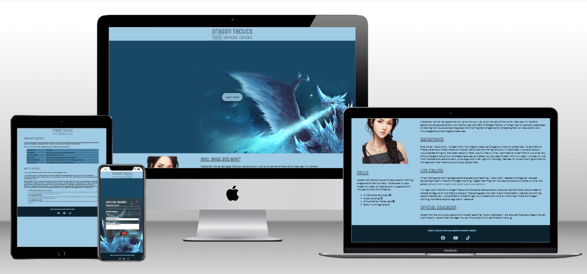

# Dragon Tactics
## Introduction
Dragon Tactics is a site made to present and advertise Seraphina Goldenstone and the LLC Dragon Tactics. The site is targetted towards people with an interest in learning to train dragons or people who are looking to make a career change and becoming a dragon trainer themselves. The site will be useful to find information about Seraphina herself, along with the courses and classes that Dragon Tactics has to offer. It will also inform potential future dragon trainers about the pros and cons in the career field.

## UX
text
### Bla
text
### User Stories
text
### Opportunities
text
## Wireframes
Text and Imagz
## Features
### Global Features
Nav, Footer
### Home page Features
About Skills
### Services Page Features
Class Table, Recruitment Information
### Contact Page Features
Contact Form with Reset and Submit buttons
### Future Enhancements
Making the Contact Form actually e-mail Seraphina
## Technologies
HTML, CSS, GitHub, Gitpod, Font Awesome, balsamiq, Photoshop CC, Medibang PRO, Lensa
## Testing
Responsiveness? 
Accessibility?=
Lighthouse?
Functional
Bunch of texts
## Validator Testing
Bla
## Deployment
The site was deployed to GitHub pages with these steps...
Live link...
## Credits
Länkar och sånt
### Content
Text och sånt skapat av mig
### Media
Bild sources